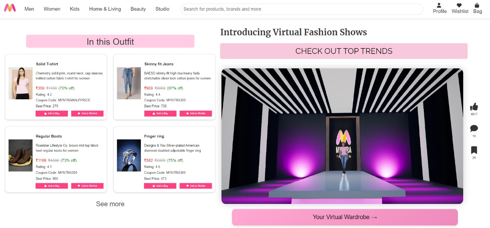

# Myntra Virtual Fashion Show - Virtual Couture

Welcome to the Myntra Virtual Fashion Show project! This innovative project combines the power of the MERN stack and Unreal Engine 5 to create an immersive and interactive fashion experience. Users can explore a virtual runway, engage with outfits, and shop directly from their virtual wardrobe.

## Features

- **Landing Page:** A vibrant and engaging landing page that invites users into the virtual fashion world.
- **Fashion Show Page:** A stunning runway experience created with Unreal Engine 5, showcasing models and outfits with interactive pricing cards.
- **Interactive Buttons:** Users can like, comment, and save outfits directly from the fashion show page.
- **Virtual Wardrobe:** A personalized space where users can view and shop from their saved outfits.

## Tech Stack

- **Frontend:** React.js
- **Backend:** Node.js, Express.js
- **Database:** MongoDB
- **3D Graphics:** Unreal Engine 5
- **Additional Tools:** Blender for 3D modeling

## Screenshots

### Landing Page


### Fashion Show Page


### Interactive Buttons


### Virtual Wardrobe


## Installation

1. **Clone the repository:**
   ```bash
   git clone https://github.com/Jasmine5220/myntra-virtual-fashion-show.git
   cd myntra-virtual-fashion-show
   ```

2. **Install dependencies for the backend:**
   ```bash
   cd backend
   npm install
   ```

3. **Install dependencies for the frontend:**
   ```bash
   cd ../frontend
   npm install
   ```

## Running the Project

1. **Start the backend server:**
   ```bash
   cd backend
   node data.js
   node data2.js
   node data3.js
   node server.js
   // Runs server at port 3000
   ```

2. **Start the frontend development server:**
   ```bash
   cd frontend
   npm start
   ```

3. **Open your browser and navigate to:**
   ```
   http://localhost:3001
   ```

## Project Structure

```
myntra-virtual-fashion-show/
├── backend/                 # Backend code
│   ├── models/              # Mongoose models
│   ├── routes/              # API routes
│   └── server.js            # Main application file
│   └── data.js              # Fetching data file
│   └── data2.js             # Fetching data file
│   └── data3.js             # Fetching data file
├── frontend/                # Frontend code
│   ├── public/              # Public assets
│   ├── src/                 # React components and pages
│   └── App.js               # Main React component
│   └── api.js               # Retrieving data from APIs
├── screenshots/             # Screenshots for the README
└── README.md                # Project documentation
```

## API Endpoints

### Outfits
- **GET /api/outfits:** Retrieve a list of all outfits
- **GET /api/items:** Retrieve details of a specific outfit
- **DELETE /api/outfits/:id:** Delete an outfit

### Virtual Wardrobe
- **GET /api/wardrobe:** Retrieve the user's virtual wardrobe
- **POST /api/wardrobe:** Add an outfit to the virtual wardrobe
- **DELETE /api/wardrobe/:id:** Remove an outfit from the virtual wardrobe

## License

This project is licensed under the MIT License.

## Thank you for visiting our project! Your perfect outfit would be a click away!
